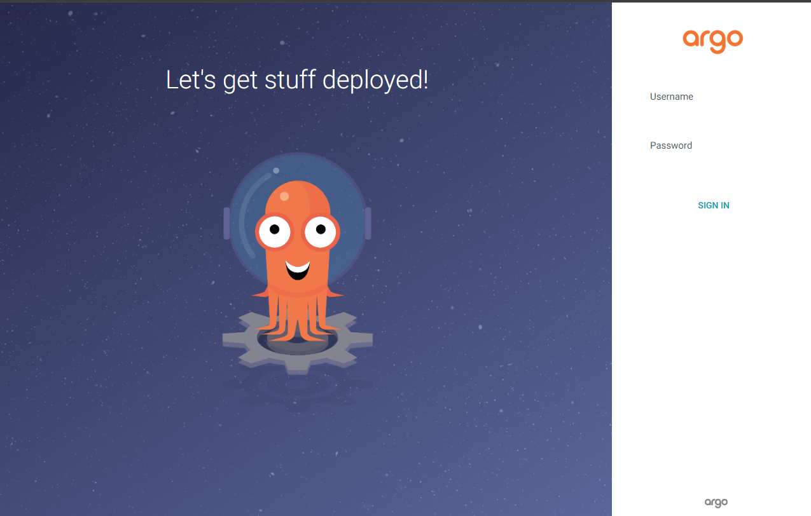

## Argo CD Login

Initial password check
```
$ argocd admin initial-password -n argocd
```

Argocdへの接続
```
kubectl get svc -n argocd
```
LoadBalancerのIPアドレスへ接続する。UsernameとPasswordを入れてログインする
Username: admin
Password: xxxxx


Passwordの初期設定は、UserInfoから変更する。

